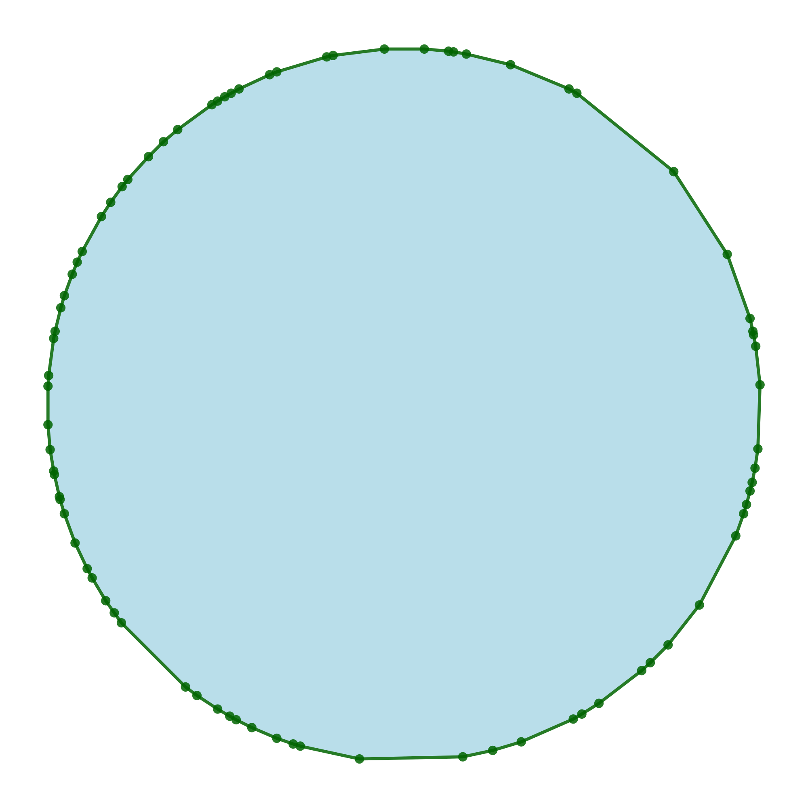
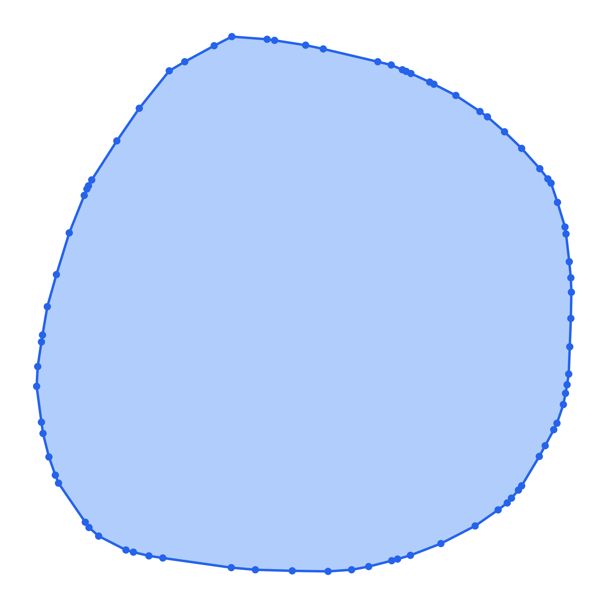
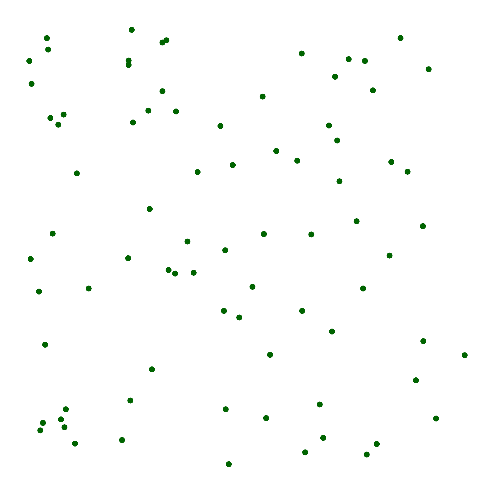
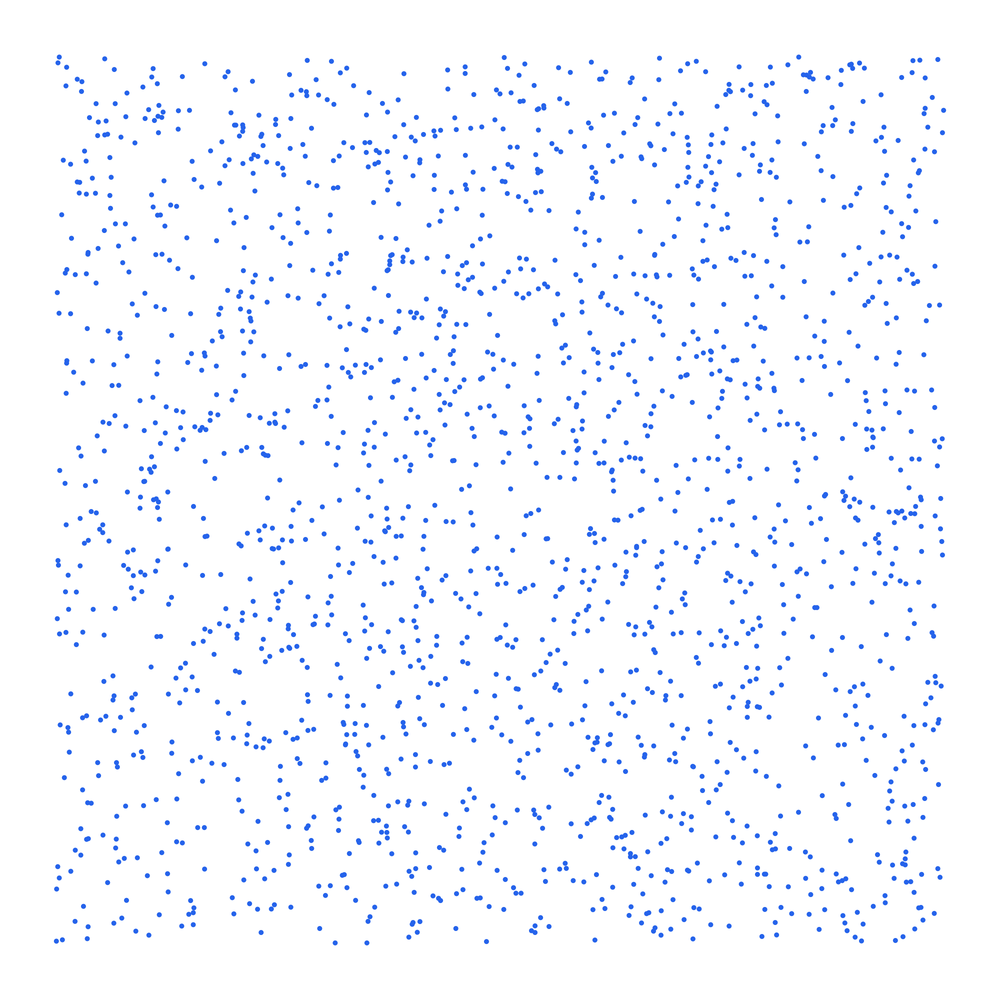
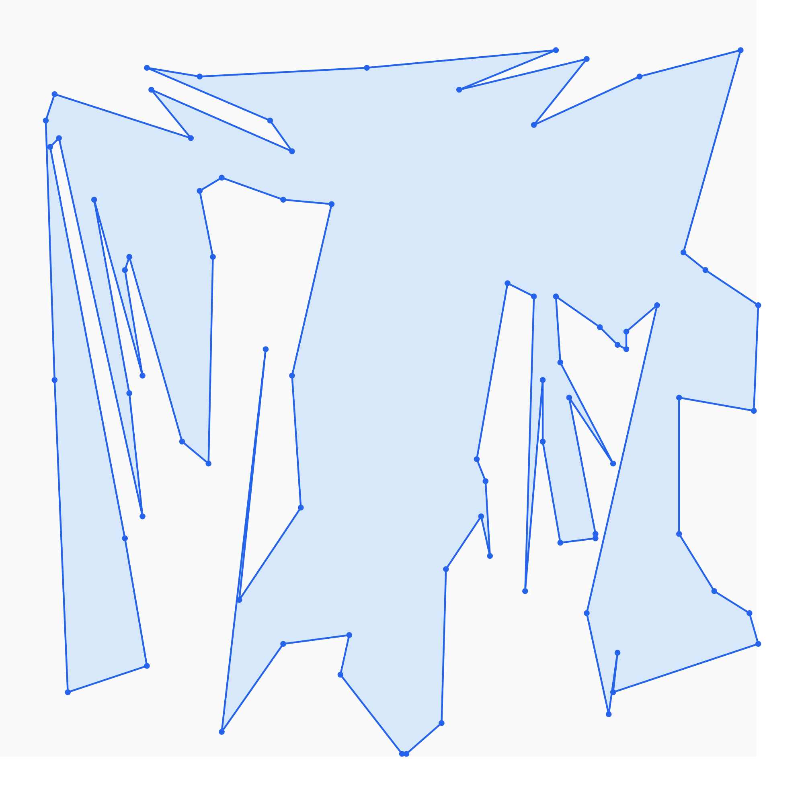

# tgen vs jngen — Feature Comparison

*Generated 2026-06-08 01:07 UTC*

> **Styled tables and geometry samples:** [view on GitHub Pages](https://brunomaletta.github.io/tgen_vs_jngen/). GitHub's Markdown renderer cannot reproduce the HTML layout.

Comparison of non-trivial generation operations. See [benchmarks.md](benchmarks.md) for timing results.

## Graphs

| Operation | jngen | tgen | Uniformity | Complexity / notes | Benchmark |
|-----------|-------|------|------------|-------------------|-----------|
| Connected random graph | Yes <code>Graph::random(n, m).connected()</code> | Yes <code>graph(n, m).get_connected()</code> | **jngen:** Non-uniform **tgen:** Non-uniform | **jngen:** Tree::random(n) + rejection edge add **tgen:** **O(n + m log n)**; spanning forest + uniform edge completion Both produce connected graphs but not uniformly over all connected labeled graphs. | **jngen:** 1114 ms **tgen:** 1061 ms 0.95x n=1e6, m=1e6 |
| Random graph with fixed n, m | Yes <code>Graph::random(n, m)</code> | Yes <code>graph(n, m).gen()</code> | **jngen:** Undocumented **tgen:** Uniform | **jngen:** Rejection on random vertex pairs; no documented bound **tgen:** **O(n + m log n)**; rejection with constraint machinery **tgen** documents uniform sampling among valid graphs; **jngen** uses undocumented rejection. | **jngen:** 624 ms **tgen:** 833 ms 1.33x n=1e6, m=1e6 |
| Skewed / stretched connected graph | Yes <code>Graph::randomStretched(n, m, elongation, spread)</code> | Yes <code>graph::gen_skewed(n, m, elongation, spread)</code> | **jngen:** Non-uniform **tgen:** Non-uniform | **jngen:** Tree::randomPrim + parent-hop biased edges; may throw after 1000 failures **tgen:** **O(n + m log n)**; wnext backbone + ancestor-biased edges Both intentionally biased toward high diameter. Parent-hop semantics differ slightly (k in [2, spread] vs up to spread hops). | **jngen:** 827 ms **tgen:** 219 ms 0.26x n=1e6, m=1e6, elongation=1e2, spread=2 |
| Graph modifiers (directed, multi, acyclic, loops) | Yes <code>Graph::random(...).directed().allowMulti().acyclic() ...</code> | Yes <code>graph(...).directed().multi().acyclic()...</code> | **jngen:** Undocumented **tgen:** Varies | **jngen:** Chaining modifiers on BuilderProxy **tgen:** Declarative constraint composition Both support modifier chains; **tgen** documents uniformity where promised. | — |
| Bipartite graph (random / complete) | Yes <code>Graph::randomBipartite(n1, n2, m), completeBipartite(n1, n2)</code> | Yes <code>graph::gen_bipartite(n1, n2, m), K(n1, n2)</code> | **jngen:** Undocumented **tgen:** Uniform | **jngen:** Rejection on random cross edges **tgen:** **O(n1 + n2 + m log(n1 + n2)**); uniform cross edges Both support random and complete bipartite graphs. **tgen** documents uniform sampling among valid bipartite graphs with m edges. | — |
| Weighted graphs and trees | Yes <code>Graph::setVertexWeights / setEdgeWeight ; Tree inherits graph weights</code> | Yes <code>wgraph / wtree (vertex- and edge-weighted variants)</code> | **jngen:** Undocumented **tgen:** Undocumented | **jngen:** Post-hoc weight assignment on generated structure **tgen:** Same generators as unweighted, plus weight assignment | — |

## Trees

| Operation | jngen | tgen | Uniformity | Complexity / notes | Benchmark |
|-----------|-------|------|------------|-------------------|-----------|
| Random labeled tree | Yes <code>Tree::random(n)</code> | Yes <code>tree(n).gen()</code> | **jngen:** Uniform **tgen:** Uniform | **jngen:** **O(n)**; Prüfer sequence **tgen:** **O(n)**; Prüfer sequence Both uniform over labeled trees. **jngen** returns sorted edges rooted at 0 by default. | **jngen:** 695 ms **tgen:** 573 ms 0.82x n=1e6 |
| Skewed tree (wnext / Prim-like) | Yes <code>Tree::randomPrim(n, elongation)</code> | Yes <code>tree::gen_skewed(n, elongation)</code> | **jngen:** Non-uniform **tgen:** Non-uniform | **jngen:** **O(n)**; same wnext process **tgen:** **O(n)**; parent(i) = wnext(i, elongation) Equivalent algorithms. Large positive elongation → path; large negative → star. | **jngen:** 342 ms **tgen:** 236 ms 0.69x n=1e6, elongation=1e2 |
| Named tree shapes (star, path, caterpillar, k-ary) | Yes <code>Tree::star, bamboo, caterpillar, binary, kary, ...</code> | Yes <code>S(n) star, P(n) path; no caterpillar/binary/k-ary</code> | **jngen:** Undocumented | **jngen:** **O(n)** **tgen:** **O(n)**; standard graph helpers (also valid trees) **tgen** exposes star and path as graph helpers; **jngen** has a richer set of named tree generators. | — |
| Random tree (Kruskal-like) | Yes <code>Tree::randomKruskal(n)</code> | **No** | **jngen:** Non-uniform | **jngen:** Rejection on random edges | — |

## Lists and sequences

| Operation | jngen | tgen | Uniformity | Complexity / notes | Benchmark |
|-----------|-------|------|------------|-------------------|-----------|
| Distinct values in range | Yes <code>Array::randomUnique(k, lo, hi)</code> | Yes <code>list<int>(k, lo, hi).all_different().gen()</code> | **jngen:** Uniform **tgen:** Uniform | **jngen:** **O(k log k)** rejection **tgen:** **O(k log k)**; Fisher–Yates + forbidden-value map Both produce uniform distinct samples. | **jngen:** 247 ms **tgen:** 1869 ms 7.57x n=1e6, value_left=1, value_right=2e6 |
| Uniform random permutation | Yes <code>Array::id(n).shuffled()</code> | Yes <code>permutation(n).gen()</code> | **jngen:** Uniform **tgen:** Uniform | **jngen:** **O(n)** **tgen:** **O(n)** | — |
| Declarative constraints (sorted, palindrome, cycles) | **No** | Yes <code>list/str/permutation/pair with .sorted(), .palindrome(), .cycles()...</code> | **tgen:** Varies | **tgen:** Constraint-based uniform sampling where documented | — |

## Math

| Operation | jngen | tgen | Uniformity | Complexity / notes | Benchmark |
|-----------|-------|------|------------|-------------------|-----------|
| Ordered partition into k parts (composition) | Yes <code>rndm.partition(n, numParts, minSize, maxSize)</code> | Yes <code>math::gen_partition_fixed_size(n, k, part_left, part_right)</code> | **jngen:** Non-uniform **tgen:** Uniform | **jngen:** Random delimiters, then sort parts descending + heuristic redistribution **tgen:** **O(n)** stars-and-bars (unbounded parts) or **O(n·k)** DP with bounds Different algorithms and semantics. **tgen** returns an ordered composition sampled uniformly. **jngen** sorts parts in non-increasing order (not a uniform composition); source comments that bounded redistribution 'need a smarter way'. | — |
| Ordered partition, variable number of parts | **No** | Yes <code>math::gen_partition(n, part_left, part_right)</code> | **tgen:** Uniform | **tgen:** **O(n)**; DP in log space | — |
| Random prime in range | Yes <code>rndm.randomPrime(l, r)</code> | Yes <code>math::gen_prime(left, right)</code> | **jngen:** Undocumented **tgen:** Uniform | **jngen:** Rejection on rnd.next(l, r) until prime **tgen:** **O(log³ n)** expected **tgen** documents uniform sampling among primes in the interval. | — |
| Random integer with congruence constraints | **No** | Yes <code>math::gen_congruent(l, r, rems, mods)</code> | **tgen:** Uniform | **tgen:** **O(|mods| + log r)** | — |
| Partition array into k groups | Yes <code>rndm.partition(elements, numParts, minSize, maxSize)</code> | **No** | **jngen:** Non-uniform | **jngen:** Shuffle elements, split by partition sizes from rndm.partition | — |

## Geometry

| Operation | jngen | tgen | Uniformity | Complexity / notes | Benchmark |
|-----------|-------|------|------------|-------------------|-----------|
| Random convex polygon | Yes <code>rndg.convexPolygon(n, min, max)</code> | Yes <code>geometry::random_convex_polygon(n, min, max)</code> | **jngen:** Non-uniform **tgen:** Non-uniform | **jngen:** Convex hull of 10n ellipse points, subsample n **tgen:** **O(n log n)**; Valtr construction filling bounding box Different shape distributions. **jngen** needs a large coordinate range at high n (hull subsampling); benchmark uses n=3.6e5, max=3e9 for both. | **jngen:** 1039 ms **tgen:** 536 ms 0.52x n=3.6e5, min=0, max=3e9 |
| Points in general position (no three collinear) | Yes <code>rndg.pointsInGeneralPosition(n, min, max)</code> | Yes <code>geometry::random_points_general_position(n, min, max)</code> | **jngen:** Undocumented **tgen:** Non-uniform | **jngen:** **O(n² log n)**; rejection until no collinearity **tgen:** **O(n)**; algebraic construction over F_p Not benchmarked head-to-head: **jngen** is asymptotically slower. | **tgen:** 167 ms n=1e6, min=0, max=3e6 |
| Random simple polygon | **No** | Yes <code>geometry::random_simple_polygon(n, min, max)</code> | **tgen:** Non-uniform | **tgen:** **O(n log n)** expected; points + polygonization | **tgen:** 1263 ms n=1e6, min=0, max=3e6 |
| Simple polygon through given points | **No** | Yes <code>geometry::random_simple_polygon_through_points(pts)</code> | **tgen:** Non-uniform | **tgen:** **O(n log n)** expected; randomized divide-and-conquer Hamiltonian path | **tgen:** 1131 ms n=1e6 |

### Samples

| Operation | jngen | tgen |
|-----------|-------|------|
| Random convex polygon | Yes <code>rndg.convexPolygon(n, min, max)</code>  | Yes <code>geometry::random_convex_polygon(n, min, max)</code>  |
| Points in general position (no three collinear) | Yes <code>rndg.pointsInGeneralPosition(n, min, max)</code>  | Yes <code>geometry::random_points_general_position(n, min, max)</code>  |
| Random simple polygon | **No** | Yes <code>geometry::random_simple_polygon(n, min, max)</code>  |
| Simple polygon through given points | **No** | Yes <code>geometry::random_simple_polygon_through_points(pts)</code>  |

## Strings and hashing

| Operation | jngen | tgen | Uniformity | Complexity / notes | Benchmark |
|-----------|-------|------|------------|-------------------|-----------|
| Regex / pattern strings | Yes <code>rnd.next("[a-z]{10}") / rnds.random(pattern)</code> | Yes <code>str("[a-z]{10}").gen()</code> | **jngen:** Non-uniform **tgen:** Uniform | **jngen:** testlib-compatible pattern syntax **tgen:** **O(n)**; uniform over matches when each string has a unique parse Same testlib-style regex syntax. **tgen** samples uniformly among matches (documented); **jngen** explicitly does not — e.g. rnd.next("[1-9][0-9]{1,2}") does not yield uniform digit strings. | — |
| Polynomial hash collision strings (signed mod) | Yes <code>rnds.antiHash({{mod, base}, ...}, alphabet, len)</code> | Yes <code>hack::polynomial_hash_hack(alphabet, base, mod)</code> | **jngen:** Undocumented **tgen:** Undocumented | **jngen:** Brute force; up to 2 mod/base pairs **tgen:** Birthday attack; up to 2 (base, mod) pairs Both generate colliding strings for rolling hash. | — |
| Polynomial hash collision (unsigned / power-of-two mod) | **No** | Yes <code>hack::unsigned_polynomial_hash_hack()</code> | — | **tgen:** **O(1)**; Thue–Morse construction | — |

## Adversarial / hack generators

| Operation | jngen | tgen | Uniformity | Complexity / notes | Benchmark |
|-----------|-------|------|------------|-------------------|-----------|
| std::unordered_set collision inputs | Yes <code>rnda.antiUnorderedSet(n, maxLoadFactor, reserve)</code> | Yes <code>hack::std_unordered(size)</code> | — | **jngen:** GCC 4.x only; tuned load factor/reserve **tgen:** GCC multiplier-based collision keys Overlap in purpose; different APIs and compiler support. | — |
| std::set collision strings | **No** | Yes <code>hack::string_set(size)</code> | — | **tgen:** Distinct strings with equal std::set ordering keys | — |
| Max-flow worst case (Dinitz / Edmonds-Karp) | **No** | Yes <code>hack::dinitz_worst_case(k, l)</code> | — | **tgen:** **O(k·l)** vertices; Zadeh network | — |
| Mo's algorithm worst-case queries | **No** | Yes <code>hack::mo(n, q)</code> | — | **tgen:** **O(q)** range queries on a path | — |
| SPFA TLE graph | **No** | Yes <code>hack::spfa_hack(n)</code> | — | **tgen:** **O(n)** vertices/edges; forces Ω(n²) relaxations | — |
| Stale-heap Dijkstra bug graph | **No** | Yes <code>hack::stale_heap_dijkstra_bug(n)</code> | — | **tgen:** Catches lazy Dijkstra without decrease-key / stale entries | — |
| Non-strict relaxation Dijkstra bug graph | **No** | Yes <code>hack::non_strict_relaxation_dijkstra_bug(n)</code> | — | **tgen:** Catches Dijkstra that relaxes on dist[v] == dist[u] + w | — |
| mt19937 XOR-hash collision mask | **No** | Yes <code>hack::mt19937_xor_hash_hack<T>()</code> | — | **tgen:** **O(1)**; bitmask for int or long long outputs | — |
| Segment-tree-beats worst case | **No** | Yes <code>hack::segment_tree_beats_hack(k, q)</code> | — | **tgen:** Initial array + q range chmin updates | — |
| Rotating calipers bug polygon | **No** | Yes <code>hack::naive_rotating_calipers_max_dist_bug()</code> | — | **tgen:** **O(1)**; fixed 6-vertex convex polygon | — |

## Other

| Operation | jngen | tgen | Uniformity | Complexity / notes | Benchmark |
|-----------|-------|------|------------|-------------------|-----------|
| Built-in SVG visualization | Yes <code>Drawer d; d.polygon(...); d.dumpSvg("out.svg")</code> | **No** | — | **jngen:** Drawer for points, segments, circles, polygons. | — |

