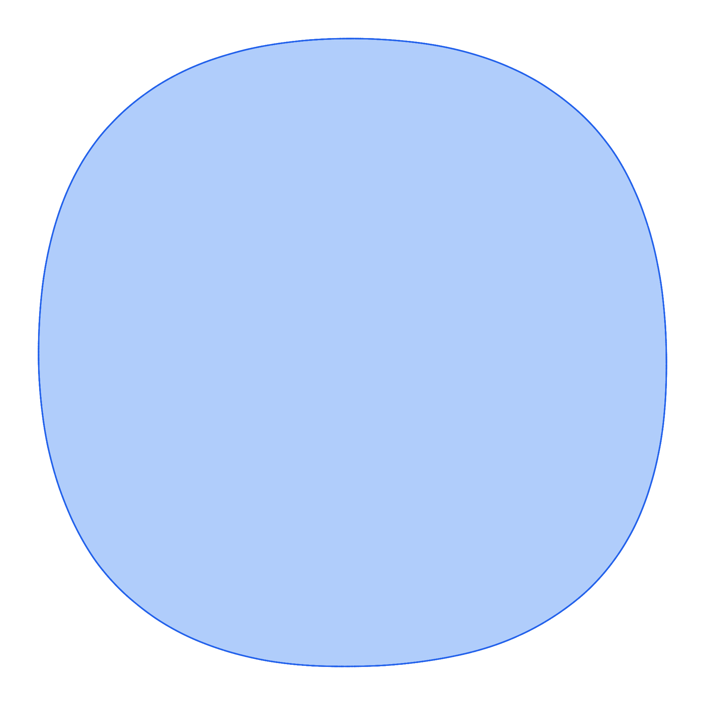

# tgen vs jngen — Feature Comparison

*Generated 2026-06-08 02:50 UTC*

> **Styled tables and geometry samples:** [view on GitHub Pages](https://brunomaletta.github.io/tgen_vs_jngen/). GitHub's Markdown renderer cannot reproduce the HTML layout.

Comparison of non-trivial generation operations. See [benchmarks.md](benchmarks.md) for timing results.

## Graphs

| Operation | jngen | tgen | Uniformity | Complexity / notes | Benchmark |
|-----------|-------|------|------------|-------------------|-----------|
| Connected random graph | Yes <code>Graph::random(n, m).connected()</code> | Yes <code>graph(n, m).get_connected()</code> | **jngen:** Non‑uniform **tgen:** Non‑uniform | **jngen:** **O(n + m)** expected (inferred); Prüfer spanning tree + rejection edge add **tgen:** **O(n + m log n)**; Prüfer spanning tree + rejection edge add
Same Prüfer tree + rejection edge add. Neither uniform over all connected labeled graphs. | **jngen:** 1263 ms **tgen:** 1214 ms 0.96x n=1e6, m=1e6 |
| Random graph with fixed n, m | Yes <code>Graph::random(n, m)</code> | Yes <code>graph(n, m).gen()</code> | **jngen:** Non‑uniform (inferred) **tgen:** Uniform | **jngen:** **O(n + m)** expected (inferred); rejection on random vertex pairs **tgen:** **O(n + m log n)**; rejection with constraint machinery
**tgen** documents uniform sampling among valid graphs; **jngen** does not. | **jngen:** 578 ms **tgen:** 892 ms 1.54x n=1e6, m=1e6 |
| Skewed / stretched connected graph | Yes <code>Graph::randomStretched(n, m, elongation, spread)</code> | Yes <code>graph::gen_skewed(n, m, elongation, spread)</code> | **jngen:** Non‑uniform **tgen:** Non‑uniform | **jngen:** **O(n + m)** expected (inferred); randomPrim backbone + parent-hop edges; may throw after 1000 failures **tgen:** **O(n + m log n)**; wnext backbone + ancestor-biased edges
Both intentionally biased toward high diameter. Parent-hop semantics differ slightly (k in [2, spread] vs up to spread hops). | **jngen:** 755 ms **tgen:** 190 ms 0.25x n=1e6, m=1e6, elongation=1e2, spread=2 |
| Graph modifiers (directed, multi, acyclic, loops) | Yes <code>Graph::random(...).directed().allowMulti().acyclic() ...</code> | Yes <code>graph(...).directed().multi().acyclic()...</code> | **jngen:** Varies (inferred) **tgen:** Varies | **jngen:** **O(n + m)** expected (inferred); same as Graph::random with modifier traits **tgen:** Declarative constraint composition
Both support modifier chains; **tgen** documents uniformity where promised. | — |
| Bipartite graph (random / complete) | Yes <code>Graph::randomBipartite(n1, n2, m), completeBipartite(n1, n2)</code> | Yes <code>graph::gen_bipartite(n1, n2, m), K(n1, n2)</code> | **jngen:** Non‑uniform (inferred) **tgen:** Uniform | **jngen:** **O(n1 + n2 + m)** expected (inferred); rejection on random cross edges **tgen:** **O(n1 + n2 + m log(n1 + n2)**); uniform cross edges
Both support random and complete bipartite graphs. **tgen** documents uniform sampling among valid bipartite graphs with m edges. | **jngen:** 206 ms **tgen:** 874 ms 4.24x n1=1e3, n2=1e3, m=5e5 |
| Complete and named graphs | Yes <code>Graph::complete(n), completeBipartite(n1, n2)</code> | Yes <code>K(n), K(n1,n2), C(n), P(n), S(n) graph helpers</code> | **jngen:** Varies **tgen:** Varies | **jngen:** **O(n²)** (inferred); deterministic edge lists **tgen:** **O(n²)** edges for cliques; **O(n)** for path/star/cycle
**tgen** exposes more named helpers (cycle, path, star as graphs). completeBipartite is deterministic. | — |
| Directed / acyclic random graph | Yes <code>Graph::random(n, m).directed().acyclic().g()</code> | Yes <code>graph(n, m, directed=true).gen(), .get_acyclic()</code> | **jngen:** Non‑uniform (inferred) **tgen:** Varies | **jngen:** **O(n + m)** expected (inferred); rejection + acyclic shuffle when needed **tgen:** **O(n + m log n)**; same rejection machinery with directed constraints
Comparable directed sampling via modifier chains. **tgen** documents uniformity for some constrained variants. | **jngen:** 623 ms **tgen:** 416 ms 0.67x n=1e6, m=1e6 |
| Weighted graphs and trees | Yes <code>Graph::setVertexWeights / setEdgeWeight ; Tree inherits graph weights</code> | Yes <code>wgraph / wtree (vertex- and edge-weighted variants)</code> | **jngen:** Non‑uniform (inferred) **tgen:** Non‑uniform (inferred) | **jngen:** **O(n + m)** (inferred); base generator + weight assignment **tgen:** Same generators as unweighted, plus weight assignment | — |

## Trees

| Operation | jngen | tgen | Uniformity | Complexity / notes | Benchmark |
|-----------|-------|------|------------|-------------------|-----------|
| Random labeled tree | Yes <code>Tree::random(n)</code> | Yes <code>tree(n).gen()</code> | **jngen:** Uniform **tgen:** Uniform | **jngen:** **O(n)**; Prüfer sequence **tgen:** **O(n)**; Prüfer sequence
Same Prüfer algorithm. **jngen** prints sorted edges rooted at 0 by default. | **jngen:** 690 ms **tgen:** 579 ms 0.84x n=1e6 |
| Rooted tree output / edge order | Yes <code>Tree::random(n) ; .println() / Repr with printEdges, shuffle</code> | Yes <code>tree(n).gen() ; stream output with configurable 1-based vertices</code> | **jngen:** Undocumented **tgen:** Undocumented | **jngen:** **O(n)** (inferred) **tgen:** **O(n)** generation; **O(n)** print
**jngen** defaults to sorted edges rooted at vertex 0. **tgen** uses declarative print helpers and 0-based internal indices. | — |
| Skewed tree (wnext / Prim-like) | Yes <code>Tree::randomPrim(n, elongation)</code> | Yes <code>tree::gen_skewed(n, elongation)</code> | **jngen:** Non‑uniform **tgen:** Non‑uniform | **jngen:** **O(n)**; same wnext process **tgen:** **O(n)**; parent(i) = wnext(i, elongation)
Equivalent algorithms. Large positive elongation → path; large negative → star. | **jngen:** 250 ms **tgen:** 161 ms 0.64x n=1e6, elongation=1e2 |
| Named tree shapes (star, path, caterpillar, k-ary) | Yes <code>Tree::star, bamboo, caterpillar, binary, kary, ...</code> | Yes <code>S(n) star, P(n) path; no caterpillar/binary/k-ary</code> | **jngen:** Varies (inferred) | **jngen:** **O(n)** (inferred) **tgen:** **O(n)**; standard graph helpers (also valid trees)
**tgen** exposes star and path as graph helpers; **jngen** has a richer set of named tree generators. | — |
| Random tree (Kruskal-like) | Yes <code>Tree::randomKruskal(n)</code> | **No** | **jngen:** Non‑uniform | **jngen:** **O(n²)** expected (inferred); rejection until connected | — |

## Lists and sequences

| Operation | jngen | tgen | Uniformity | Complexity / notes | Benchmark |
|-----------|-------|------|------------|-------------------|-----------|
| Distinct values in range | Yes <code>Array::randomUnique(k, lo, hi)</code> | Yes <code>list<int>(k, lo, hi).all_different().gen()</code> | **jngen:** Uniform **tgen:** Uniform | **jngen:** **O(k log k)** expected (inferred); hash-set rejection **tgen:** **O(k log k)**; Fisher–Yates + forbidden-value map
Both produce uniform distinct samples. | **jngen:** 254 ms **tgen:** 1884 ms 7.42x n=1e6, value_left=1, value_right=2e6 |
| Uniform random permutation | Yes <code>Array::id(n).shuffled()</code> | Yes <code>permutation(n).gen()</code> | **jngen:** Uniform **tgen:** Uniform | **jngen:** **O(n)** **tgen:** **O(n)** | **jngen:** 17 ms **tgen:** 12 ms 0.71x n=1e6 |
| Pairs, tuples, structured printing | Yes <code>Array / Graph .println(), Repr modifiers (shuffle, reverse, edges)</code> | Yes <code>pair(...), list/str/... with << and multi-line tuple layout</code> | **jngen:** Undocumented **tgen:** Varies | **jngen:** **O(output size)** (inferred) **tgen:** **O(output size)**
**tgen** has first-class pair/tuple generators and stream formatting. **jngen** focuses on testlib-style println helpers. | — |
| Declarative constraints (sorted, palindrome, cycles) | **No** | Yes <code>list/str/permutation/pair with .sorted(), .palindrome(), .cycles()...</code> | **tgen:** Varies | **tgen:** Constraint-based uniform sampling where documented | — |

## Math

| Operation | jngen | tgen | Uniformity | Complexity / notes | Benchmark |
|-----------|-------|------|------------|-------------------|-----------|
| Ordered partition into k parts (composition) | Yes <code>rndm.partition(n, numParts, minSize, maxSize)</code> | Yes <code>math::gen_partition_fixed_size(n, k, part_left, part_right)</code> | **jngen:** Non‑uniform **tgen:** Uniform | **jngen:** **O(k log k)** (inferred); random delimiters, sort, heuristic redistribution **tgen:** **O(n)** stars-and-bars (unbounded parts) or **O(n·k)** DP with bounds
Different algorithms and semantics. **tgen** returns an ordered composition sampled uniformly. **jngen** sorts parts in non-increasing order (not a uniform composition); source comments that bounded redistribution 'need a smarter way'. | — |
| Ordered partition, variable number of parts | **No** | Yes <code>math::gen_partition(n, part_left, part_right)</code> | **tgen:** Uniform | **tgen:** **O(n)**; DP in log space | — |
| Random prime in range | Yes <code>rndm.randomPrime(l, r)</code> | Yes <code>math::gen_prime(left, right)</code> | **jngen:** Uniform (inferred) **tgen:** Uniform | **jngen:** **O((r−l)** log r) worst case (inferred); Miller–Rabin rejection **tgen:** **O(log³ n)** expected
**tgen** documents uniform sampling among primes in the interval. | — |
| Random integer with congruence constraints | **No** | Yes <code>math::gen_congruent(l, r, rems, mods)</code> | **tgen:** Uniform | **tgen:** **O(|mods| + log r)** | — |
| Partition array into k groups | Yes <code>rndm.partition(elements, numParts, minSize, maxSize)</code> | **No** | **jngen:** Non‑uniform | **jngen:** **O(n + k log k)** (inferred); shuffle + partition sizes + split | — |

## Geometry

| Operation | jngen | tgen | Uniformity | Complexity / notes | Benchmark |
|-----------|-------|------|------------|-------------------|-----------|
| Random convex polygon | Yes <code>rndg.convexPolygon(n, min, max)</code> | Yes <code>geometry::random_convex_polygon(n, min, max)</code> | **jngen:** Non‑uniform **tgen:** Non‑uniform | **jngen:** **O(n log n)** (inferred); hull of 10n ellipse points, subsample n **tgen:** **O(n log n)**; Valtr construction filling bounding box
Different shape distributions. **jngen** needs a large coordinate range at high n (hull subsampling); benchmark uses n=3.6e5, max=3e9 for both. | **jngen:** 968 ms **tgen:** 498 ms 0.51x n=3.6e5, min=0, max=3e9 |
| Points in general position (no three collinear) | Yes <code>rndg.pointsInGeneralPosition(n, min, max)</code> | Yes <code>geometry::random_points_general_position(n, min, max)</code> | **jngen:** Non‑uniform (inferred) **tgen:** Non‑uniform | **jngen:** **O(n² log n)** expected (inferred); rejection until no collinearity **tgen:** **O(n)**; algebraic construction over F_p
Not benchmarked head-to-head: **jngen** is asymptotically slower. | **tgen:** 150 ms n=1e6, min=0, max=3e6 |
| Random simple polygon | **No** | Yes <code>geometry::random_simple_polygon(n, min, max)</code> | **tgen:** Non‑uniform | **tgen:** **O(n log n)** expected; points + polygonization | **tgen:** 1234 ms n=1e6, min=0, max=3e6 |
| Simple polygon through given points | **No** | Yes <code>geometry::random_simple_polygon_through_points(pts)</code> | **tgen:** Non‑uniform | **tgen:** **O(n log n)** expected; randomized divide-and-conquer Hamiltonian path | **tgen:** 1097 ms n=1e6 |
| Random convex polygon at n=1e6 (tgen scale) | **No** | Yes <code>geometry::random_convex_polygon(1e6, min, max)</code> | **tgen:** Non‑uniform | **tgen:** **O(n log n)**; Valtr construction
**jngen** convexPolygon needs hull(10n) vertices and large coordinates; practical n is much lower at the same max coordinate. | **tgen:** 2070 ms n=1e6, min=0, max=3e9 |

### Samples

| Operation | jngen | tgen |
|-----------|-------|------|
| Random convex polygon | Yes <code>rndg.convexPolygon(n, min, max)</code> n=80, min=0, max=1000  n=15000, min=0, max=3e9  | Yes <code>geometry::random_convex_polygon(n, min, max)</code> n=80, min=0, max=1000  n=15000, min=0, max=3e9  |
| Points in general position (no three collinear) | Yes <code>rndg.pointsInGeneralPosition(n, min, max)</code> n=2000, min=0, max=3e6  | Yes <code>geometry::random_points_general_position(n, min, max)</code> n=2000, min=0, max=3e6  |
| Random simple polygon | **No** | Yes <code>geometry::random_simple_polygon(n, min, max)</code> n=80, min=0, max=1000  |
| Simple polygon through given points | **No** | Yes <code>geometry::random_simple_polygon_through_points(pts)</code> 10×10 input grid, min=0, max=1000  |

## Strings

| Operation | jngen | tgen | Uniformity | Complexity / notes | Benchmark |
|-----------|-------|------|------------|-------------------|-----------|
| Regex / pattern strings | Yes <code>rnd.next("[a-z]{10}") / rnds.random(pattern)</code> | Yes <code>str("[a-z]{10}").gen()</code> | **jngen:** Non‑uniform **tgen:** Uniform | **jngen:** **O(output length)** (inferred); testlib-compatible pattern generation **tgen:** **O(n)**; uniform over matches when each string has a unique parse
Same testlib-style regex syntax. **tgen** samples uniformly among matches (documented); **jngen** explicitly does not — e.g. rnd.next("[1-9][0-9]{1,2}") does not yield uniform digit strings. | — |

## Hacks

| Operation | jngen | tgen | Uniformity | Complexity / notes | Benchmark |
|-----------|-------|------|------------|-------------------|-----------|
| Polynomial hash collision strings (signed mod) | Yes <code>rnds.antiHash({{mod, base}, ...}, alphabet, len)</code> | Yes <code>hack::polynomial_hash_hack(alphabet, base, mod)</code> | **jngen:** Undocumented **tgen:** Undocumented | **jngen:** **O(√mod)** expected (inferred); brute force over short strings **tgen:** Birthday attack; up to 2 (base, mod) pairs
Deterministic collision construction, not random sampling. Both generate colliding strings for rolling hash. | — |
| Polynomial hash collision (unsigned / power-of-two mod) | **No** | Yes <code>hack::unsigned_polynomial_hash_hack()</code> | — | **tgen:** **O(1)**; Thue–Morse construction | — |
| std::unordered_set collision inputs | Yes <code>rnda.antiUnorderedSet(n, maxLoadFactor, reserve)</code> | Yes <code>hack::std_unordered(size)</code> | — | **jngen:** GCC 4.x only; tuned load factor/reserve **tgen:** GCC multiplier-based collision keys
Overlap in purpose; different APIs and compiler support. | — |
| std::set collision strings | **No** | Yes <code>hack::string_set(size)</code> | — | **tgen:** Distinct strings with equal std::set ordering keys | — |
| Max-flow worst case (Dinitz / Edmonds-Karp) | **No** | Yes <code>hack::dinitz_worst_case(k, l)</code> | — | **tgen:** **O(k·l)** vertices; Zadeh network | — |
| Mo's algorithm worst-case queries | **No** | Yes <code>hack::mo(n, q)</code> | — | **tgen:** **O(q)** range queries on a path | — |
| SPFA TLE graph | **No** | Yes <code>hack::spfa_hack(n)</code> | — | **tgen:** **O(n)** vertices/edges; forces Ω(n²) relaxations | — |
| Stale-heap Dijkstra bug graph | **No** | Yes <code>hack::stale_heap_dijkstra_bug(n)</code> | — | **tgen:** Catches lazy Dijkstra without decrease-key / stale entries | — |
| Non-strict relaxation Dijkstra bug graph | **No** | Yes <code>hack::non_strict_relaxation_dijkstra_bug(n)</code> | — | **tgen:** Catches Dijkstra that relaxes on dist[v] == dist[u] + w | — |
| mt19937 XOR-hash collision mask | **No** | Yes <code>hack::mt19937_xor_hash_hack<T>()</code> | — | **tgen:** **O(1)**; bitmask for int or long long outputs | — |
| Segment-tree-beats worst case | **No** | Yes <code>hack::segment_tree_beats_hack(k, q)</code> | — | **tgen:** Initial array + q range chmin updates | — |
| Rotating calipers bug polygon | **No** | Yes <code>hack::naive_rotating_calipers_max_dist_bug()</code> | — | **tgen:** **O(1)**; fixed 6-vertex convex polygon | — |

## Other

| Operation | jngen | tgen | Uniformity | Complexity / notes | Benchmark |
|-----------|-------|------|------------|-------------------|-----------|
| testlib integration | Yes <code>registerGen, global rnd/rndm/rndg, testlib-compatible patterns</code> | **No** | — | **jngen** is built on testlib. **tgen** is a standalone header with register_gen and its own constraint API. | — |
| Built-in SVG visualization | Yes <code>Drawer d; d.polygon(...); d.dumpSvg("out.svg")</code> | **No** | — | **jngen:** Drawer for points, segments, circles, polygons. | — |

